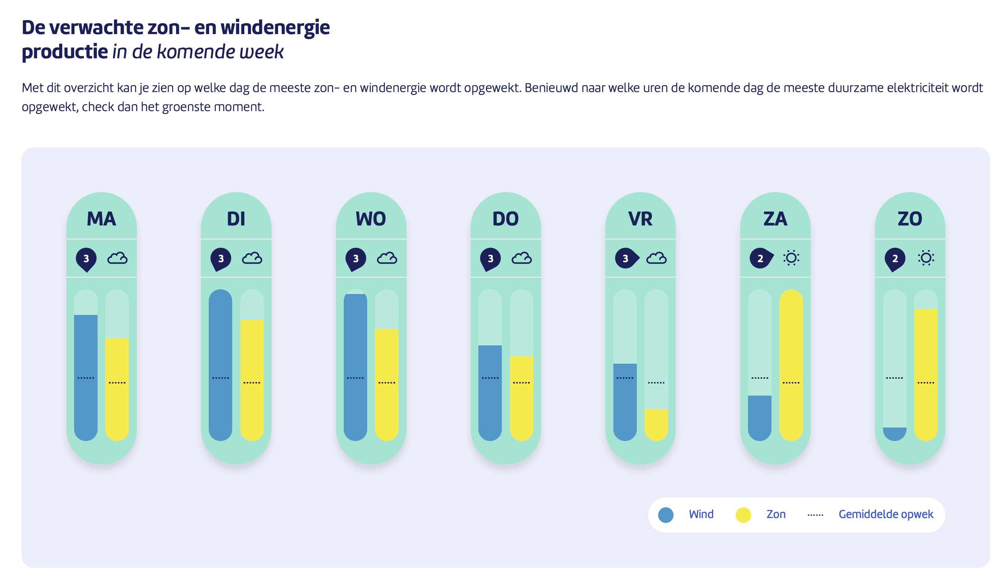
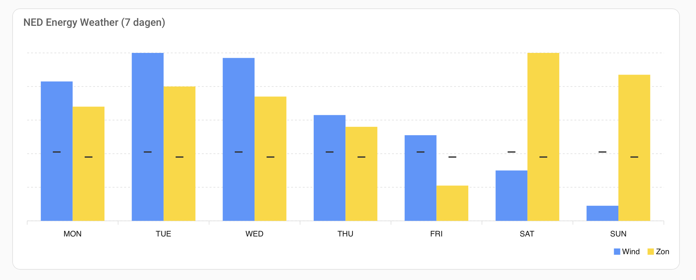

# 🌤️ NED Energy Weather in Home Assistant

Een visueel dashboard voor Home Assistant geïnspireerd op de **verwachte zon- en windenergieproductie** van [NED](https://ned.nl).

Op de website van NED kun je zien op welke dagen in de komende week de meeste zon- en windenergie wordt opgewekt. Dat wilde ik ook in mijn eigen Home Assistant-dashboard kunnen zien, dus heb ik deze set REST- en template-sensoren gemaakt, gecombineerd met een ApexCharts-kaart.

Het resultaat: een duidelijke weergave van zon- en windopwekking per dag, inclusief een streepje dat het gemiddelde per dag weergeeft.

---

## 🧩 Bestanden in deze repo

- `rest.yaml`  
  REST-sensoren die de JSON-data van NED ophalen (zon/wind per dag, inclusief averages).

- `template.yaml`  
  Template-sensoren voor o.a. daglabels (MON, TUE, …) en afgeleide waarden.

- `ned.png`  
  Screenshot van de originele NED-weergave (inspiratie).

- `homeassistant.png`  
  Screenshot van de weergave in Home Assistant.

---

## 🖼️ Voorbeelden

### Originele weergave op ned.nl



### Weergave in Home Assistant



---

## ⚙️ Installatie

### 1. Vereisten

- Home Assistant  
- [ApexCharts-card](https://github.com/RomRider/apexcharts-card) (via HACS installeren)  
- Werkende internetverbinding (voor het ophalen van de NED JSON)

### 2. REST- en template-sensoren toevoegen

1. Open je `configuration.yaml`.
2. Kopieer de inhoud van `rest.yaml` en plak die onder de sleutel `rest:`  
   (of voeg een `rest:`-blok toe als je die nog niet hebt):

   ```yaml
   rest:
     # inhoud uit rest.yaml
     - resource: "https://ned.nl/sites/default/files/dataset_chart_jsons/Energy_Weather_Forecast.json"
       scan_interval: 14400
       timeout: 10
       sensor:
         # ...
